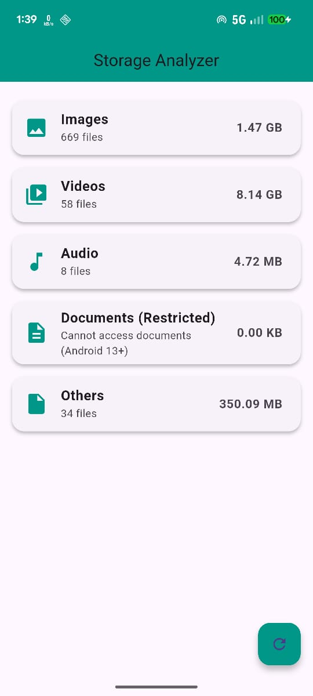

A simple Flutter app to analyze device storage by scanning folders like Images, Videos, Audio, and Downloads.

Requests and handles storage permissions.

Shows file count and total size for each category.

Allows user to scan folders manually.

Displays message “Can’t access Documents” for restricted folders (Android 13 +).
flutter-storage-analyzer/
  lib/
    models/
      - file_category_model.dart
    presenters/
      - storage_presenter.dart
    views/
      - storage_view.dart
    - main.dart
  android/
    - AndroidManifest.xml
  images/
    - home_screen.png
    - scan_folder.png
    - permission_denied.png
  pubspec.yaml
  README.md

 -- ## 🖼 Screenshots
 
 
    
 

 --

  1.Clone the repository
  git clone https://github.com/daspranay918/flutter-storage-analyzer
  2.Navigate to the project folder
  cd flutter-storage-analyzer

